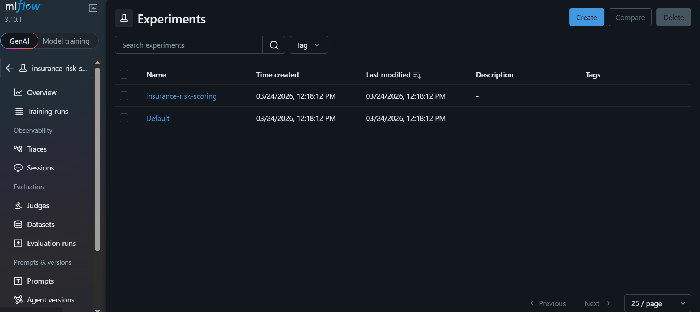
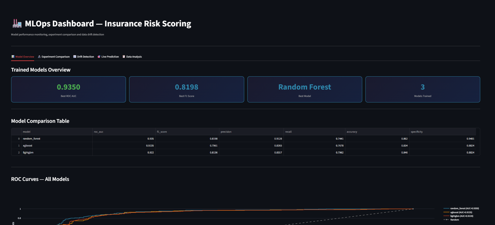
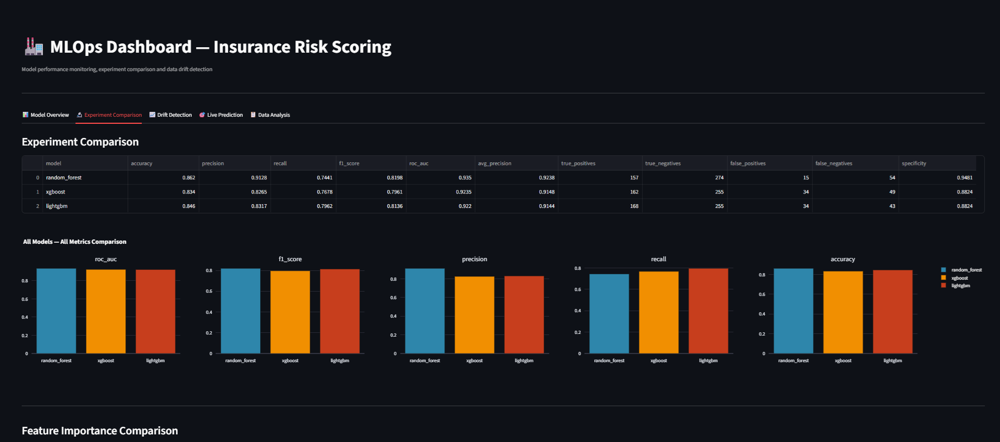
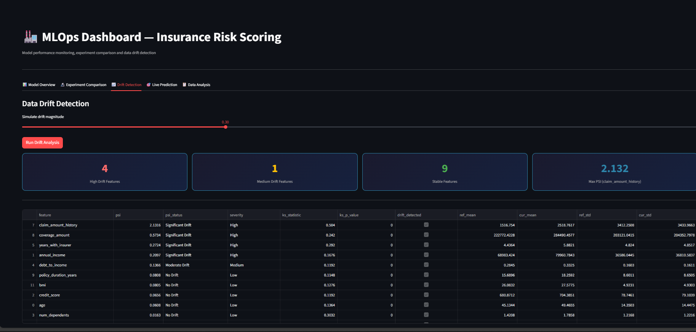
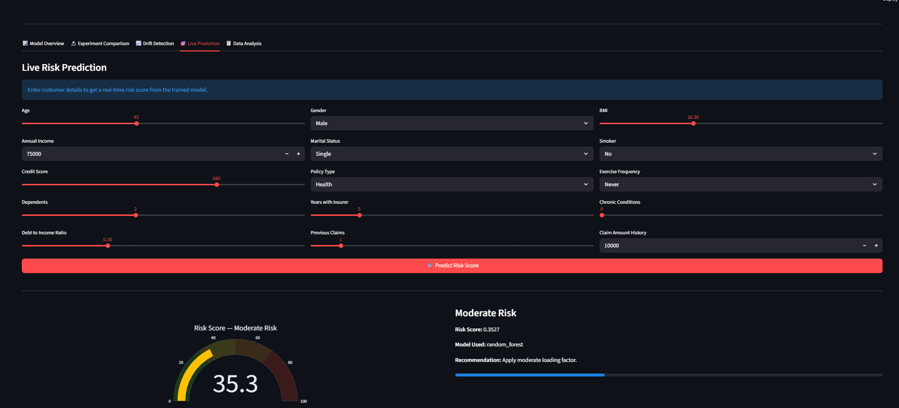
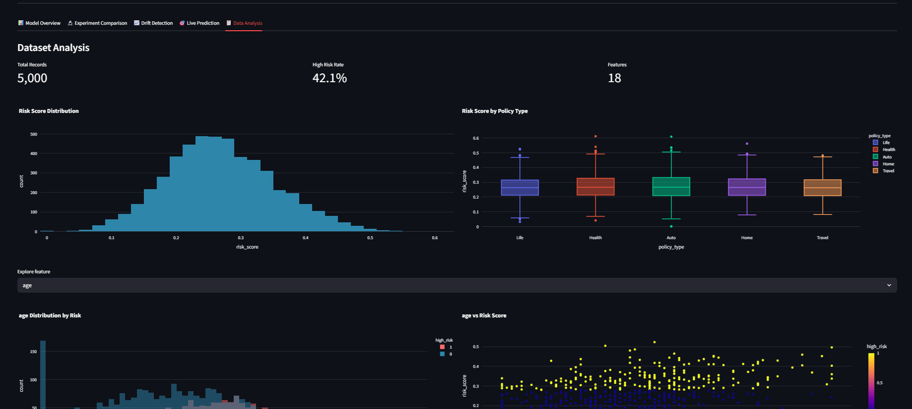

# 🏭 MLOps Insurance Risk Scoring Pipeline

<p align="center">
  
  
  
  
  
  
</p>

> A production-grade MLOps pipeline for insurance risk scoring — trains 3 models (Random Forest, XGBoost, LightGBM), tracks experiments with MLflow, tunes hyperparameters with Optuna, deploys via FastAPI, detects data drift with PSI + KS tests, and monitors everything in a Streamlit dashboard.

---

## 🚀 Demo








---

## 🏗️ Architecture

```
data/generate.py        → Generate 5,000 synthetic insurance records
        ↓
train.py                → Train RF + XGBoost + LightGBM
  ├── tune.py           → Optuna hyperparameter tuning per model
  ├── evaluate.py       → Metrics, ROC curves, confusion matrix
  ├── drift.py          → PSI + KS drift detection
  └── MLflow tracking   → Log params, metrics, plots, models
        ↓
saved_models/           → Serialised model files (.pkl)
        ↓
   ┌────────────────────────────┐
   │                            │
   ▼                            ▼
api/main.py              dashboard/app.py
FastAPI REST API         Streamlit monitoring dashboard
POST /predict            Model comparison
GET /health              Drift detection
GET /model/info          Live predictions
                         Data analysis
```

---

## ✨ Features

### 🔬 Model Training
- **3 algorithms**: Random Forest, XGBoost, LightGBM
- **Optuna tuning**: Bayesian hyperparameter optimisation
- **MLflow tracking**: Every experiment logged with params, metrics, plots

### 📊 Evaluation
- ROC AUC, F1, Precision, Recall, Accuracy, Specificity
- ROC curves, confusion matrices, feature importance plots
- Automatic best model selection

### 📈 Data Drift Detection
- **PSI** (Population Stability Index) per feature
- **KS Test** (Kolmogorov-Smirnov) for distribution comparison
- Severity classification: No Drift / Moderate / Significant

### 🚀 Deployment
- FastAPI REST endpoint with Pydantic validation
- Risk score + category + business recommendation
- Prediction logging and history

### 🖥️ Monitoring Dashboard
- 5-tab Streamlit dashboard
- Model comparison visualisations
- Live prediction with gauge chart
- Drift analysis with PSI bar charts
- Dataset exploration

---

## ⚙️ Setup

```bash
git clone https://github.com/chhabralovish/mlops-insurance-risk-pipeline.git
cd mlops-insurance-risk-pipeline
python -m venv .venv
.venv\Scripts\activate
pip install -r requirements.txt
```

---

## ▶️ How to Run

### Step 1 — Generate Data
```bash
python data/generate.py
```

### Step 2 — Train Models (with Optuna tuning)
```bash
python train.py --tune --trials 20
```

### Step 3 — View MLflow UI
```bash
mlflow ui
# Open http://localhost:5000
```

### Step 4 — Start API
```bash
uvicorn api.main:app --reload --port 8000
# Open http://localhost:8000/docs
```

### Step 5 — Start Dashboard
```bash
streamlit run dashboard/app.py
```

---

## 📂 Project Structure

```
mlops-insurance-risk-pipeline/
│
├── train.py                # Main training pipeline
├── models.py               # Model definitions + preprocessing
├── evaluate.py             # Metrics + plots
├── tune.py                 # Optuna tuning per algorithm
├── drift.py                # PSI + KS drift detection
│
├── api/
│   └── main.py             # FastAPI prediction endpoint
│
├── dashboard/
│   └── app.py              # Streamlit monitoring dashboard
│
├── data/
│   └── generate.py         # Synthetic dataset generator
│
├── saved_models/           # Serialised models (auto-created)
├── mlruns/                 # MLflow tracking (auto-created)
├── requirements.txt
└── README.md
```

---

## 🎯 API Usage

```bash
curl -X POST http://localhost:8000/predict \
  -H "Content-Type: application/json" \
  -d '{
    "age": 45, "gender": "Male", "marital_status": "Married",
    "annual_income": 75000, "credit_score": 680,
    "num_dependents": 2, "debt_to_income": 0.3,
    "years_with_insurer": 5, "previous_claims": 1,
    "claim_amount_history": 15000, "policy_type": "Health",
    "coverage_amount": 500000, "policy_duration_years": 10,
    "num_policies": 2, "bmi": 26.5, "smoker": 0,
    "exercise_frequency": "Sometimes", "chronic_conditions": 1
  }'
```

Response:
```json
{
  "risk_score": 0.4231,
  "risk_category": "Moderate Risk",
  "high_risk": false,
  "confidence": 0.5769,
  "model_used": "lightgbm",
  "recommendation": "Apply standard premium with moderate loading factor."
}
```

---

## 👨‍💻 Author

**Lovish Chhabra** — Data Scientist & AI Engineer

[](https://www.linkedin.com/in/lovish-chhabra/)
[](https://github.com/chhabralovish)

---

## 📄 License
MIT License